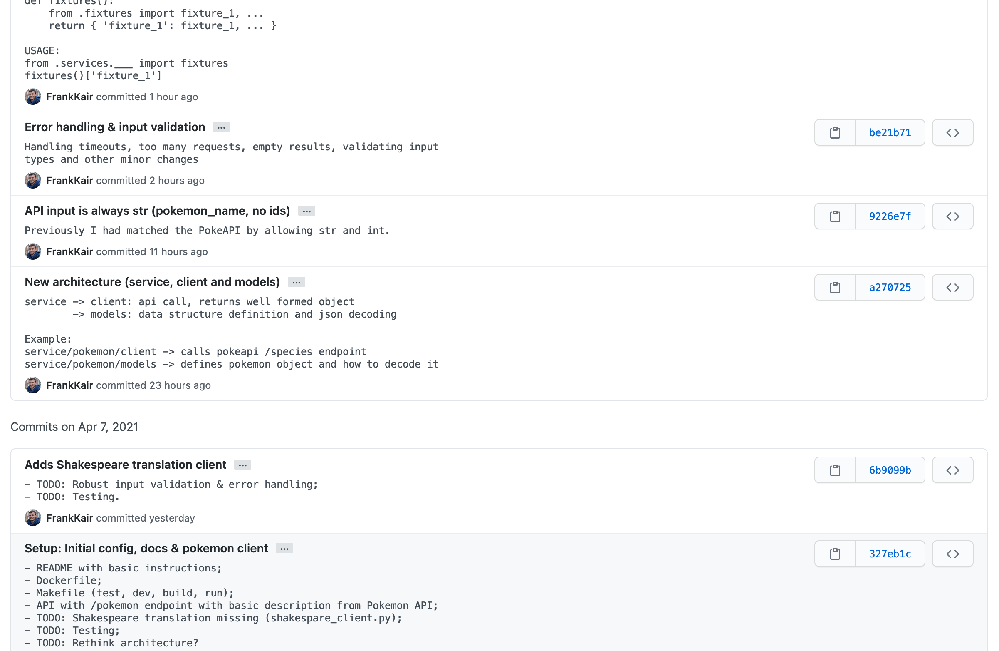
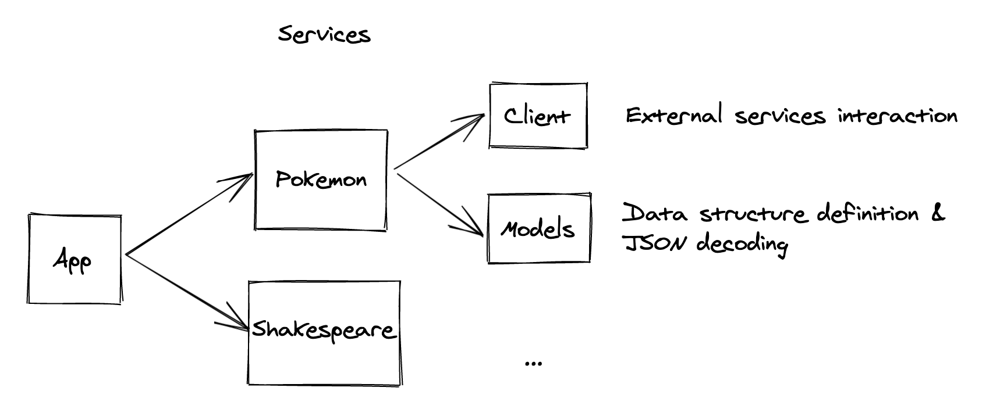

## 📝 Notes & improvements

This document contains notes giving an overview of the codebase and also a section dedicated to improvements and alternative ideas that were considered.

### Git history

You can check the commit history on [this](https://github.com/FrankKair/pokemon-shakespeare/commits/master) link. Commit titles are brief and commit messages are longer, trying to describe what I was thinking at the time. Here's a screenshot:



### Architecture

Here's a simple diagram showing the project structure and the responsability of each module:



### Testing

Calling external services when testing has several disadvantages:

- Latency - slowing down the tests;
- Shakespeare translation has rate limiting;
- What if we were paying for the requests?
- etc.

[responses](https://github.com/getsentry/responses) was chosen to mock the http calls as follows:

```python
@responses.activate
def test_example():
    responses.add(
        method=responses.GET,
        url=TEST_URL,
        json=mocked_response,
        status=200
    )
    ...
    ...
    assert ___ == ___
```

So everytime we would have called TEST_URL, responses will intercept it.

### Caching

Python's [LRU cache](https://docs.python.org/3/library/functools.html#functools.lru_cache) was used to cache the results from the external API calls for these reasons:

- Since the API is readonly, it's a great opportunity to increase performance;
- [PokeAPI](https://pokeapi.co/) is used by a lot of people, so the less we interact with it the better;
- [Shakespeare translator](https://funtranslations.com/api/shakespeare) has rate limiting of 60 requests per day.

We could have implemented our own LRU cache - it's basically a hash table that evicts its oldest entry when reaching its maximum size, but for pragmatism and simplicity, Python's LRU cache is absolutely fine.

## Improvements & alternative ideas

Here is a list of small improvements and ideas that were considered.

### Service as an Abstract Base Class (ABC)

Commonly named as interface, trait or protocol in other languages, this could serve as the contract which all services have to fullfil. I opted by not defining it and having free functions because I have a tendency to prefer more functional approaches.

```python
# Generics -> https://docs.python.org/3/library/typing.html#typing.Generic
T = TypeVar('T')

class Service(ABC):
    @abstractmethod
    def get(input_data: str) -> Dict[str, Any]:
        pass

    @abstractmethod
    def decode() -> T:
        pass


# Client usage
d = PokemonService().get('charizard').decode().description()
t = ShakespeareService().get(d).decode().translation()
```

### Pokemon object with description

We could have a Pokemon object with description, instead of mirroring the API call with flavor_text_entries:

```python
# This
@dataclass(frozen=True)
class Pokemon:
    name: str
    flavor_text_entries: List[FlavorTextEntry]


# Could be like this
@dataclass(frozen=True)
class PokemonAlternativeImplementation:
    name: str
    description: str
```

### External persistence

[Redis](https://redis.io/) could be used to provide external caching (instead of our in-memory counterpart), and a simple database (SQLite?) for persistence. Overkill? 😅

### Requester

We could have a higher-level requester function (or object/class, etc) that encapsulates all http behaviours for us automatically such as:

- Retries / circuit breaking;
- Timeouts;
- Handling different status codes;
- etc.

```python
T = TypeVar('T')

# Something along the lines of the following
@lru_cache(maxsize=16)
def get_request(url: str) -> T:
    retries = 5
    while retries > 0:
        try:
            response = requests.get(url, timeout=5)
        except requests.exceptions.Timeout:
            retries -= 1

    if response is None:
        raise Error('Error message here')

    return response.json()
```

### Naming convention

The project is structure as this:

```
services/pokemon/client.py, models.py, fixtures.py
services/shakespeare/client.py, models.py, fixtures.py
```

Using the directories/modules as namespaces, the filenames are the same. There are some who prefer more explicit naming:

```
services/pokemon/pokemon_client.py, pokemon_models.py, pokemon_fixtures.py
```
