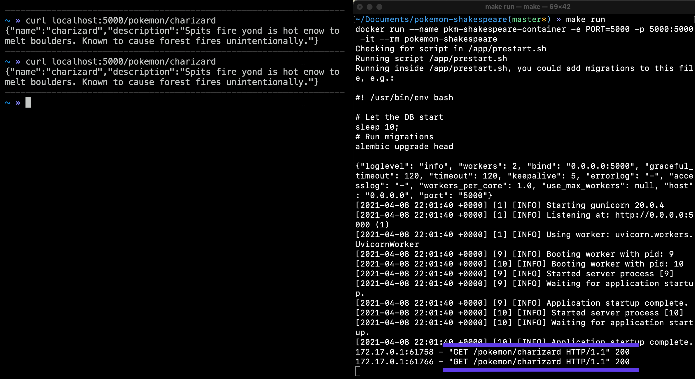
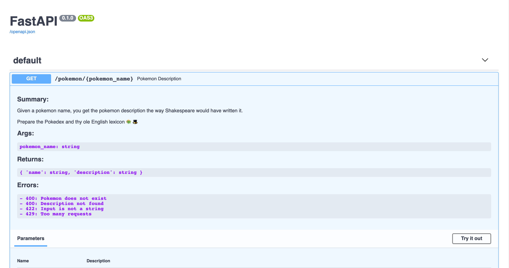
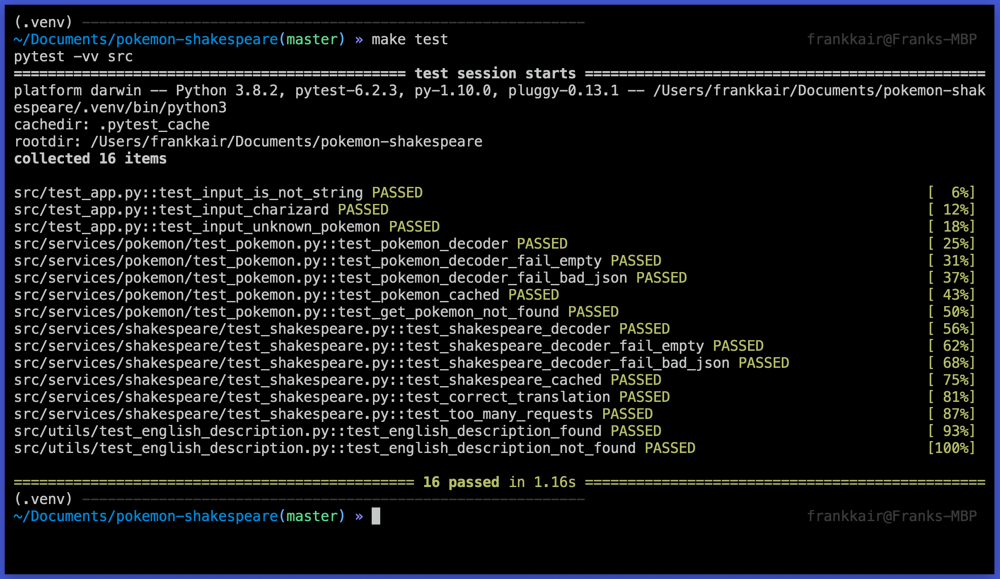

# pokemon-shakespeare

[](https://github.com/frankkair/pokemon-shakespeare/actions/workflows/test-and-docker-build.yml)

Given a pokemon name, you get the pokemon description the way Shakespeare would have written it.

👒 Prepare the Pokedex and thy ole English lexicon 🎩

## ⚙️ Requirements

- 🐳 Docker
- 🐍 Python3 (local setup)

## 🚀 Run the app

Run `$ make build` and then `$ make run` to run the application on port 5000.

```
$ curl localhost:5000/pokemon/charizard
```



## 📖 Documentation

See the documentation at [/docs](http://localhost:5000/docs#/) (needs the app running either on Docker or locally).



## 💻 Local setup

You need Python3 installed to run the application locally, check the Python [downloads](https://www.python.org/downloads/) page, or use your favourite package manager (if you're running macOS and [brew](https://brew.sh/), a simple `brew install python3` will do).

Once this is done, use the commands below to create a [virtual environment](https://docs.python.org/3/tutorial/venv.html) and install the necessary [dependencies](https://docs.python.org/3/installing/index.html):

```
$ python3 -m venv .venv
$ source .venv/bin/activate
$ pip install -r requirements.txt
```

Once you have your [virtual environment](https://docs.python.org/3/tutorial/venv.html) set up, you can run tests and the application via:

```
$ make test
```

```
$ make dev
```



